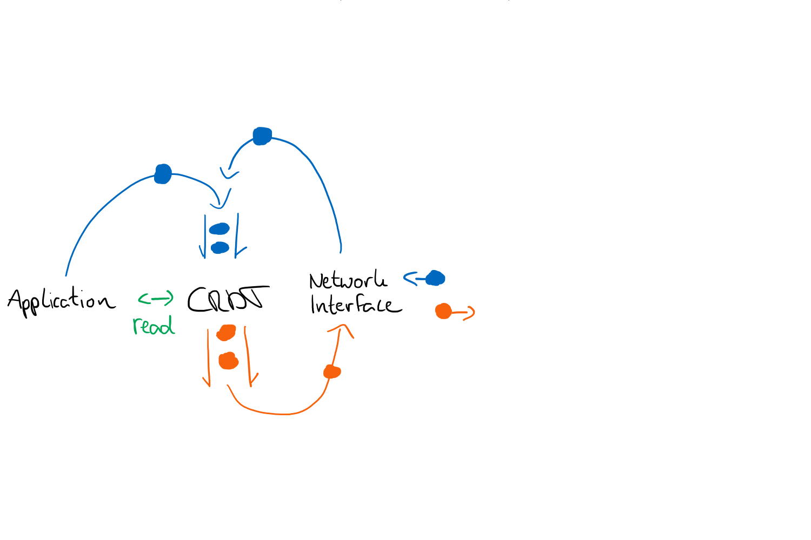

# Conflict-free Replicated DataTypes 

Library of different CRDTs with async and sequential interface.

Here is a minimal [collaborative text editor](https://git.rwth-aachen.de/reitz/crdt-text-editor) built on this library.

## Implemented CRDTs

* **RFA** (Replicated Fixed-sized Array)
* **RHT** (Replicated Hash-table)
* **RGA** (Replicated Growable Array), according to _Replicated abstract data types: Building blocks for collaborative applications_

## API

Local changes to the CRDTs are made by enqueueing operations and then processing the queue.

_coroutine_ `enqueue_op` - Enqueue an operation to be processed  
`enqueue_op_nowait`  
`read`  
_coroutine_ `start_consuming` - Run forever loop, consuming operations as they come in.  
_coroutine_ `process_queue` - Processes queue until empty  
`process_queue_nowait`  

## Roadmap

1. JSON CRDT according to _A Conflict-Free Replicated JSON Datatype_

## Open questions

* Should the library or application be responsible for network traffic? -> My intuition the application
* Should the library or application be responsible for serializing operation data?
* How do I introduce new participating processes?
    * What state do they get and how? 
        * Option 1: Give them the most current state (How?)
        * Option 2: Initialize them with an empty container and apply all operations. (Where are the oeprations stored, and who will communicate them?)
            * Every/some process could store all of the history and transmit it upon request 
    * How do I append new participating processes to Timestamps? 

## ToDos
* I still need to implement cemetery-cleanup
* Should I implement an interface to directly apply local operations?
